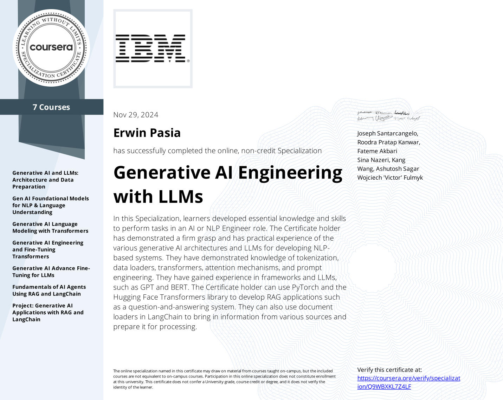

# [Generative AI Engineering with LLMs Specialization's Capstone Project](https://www.coursera.org/account/accomplishments/specialization/Q9WBXKL7Z4LF) - COMPLETED!

The **Generative AI Engineering with LLMs Specialization** equips learners with essential skills to meet the growing demand for Gen AI engineers. The Gen AI market is projected to grow at a rate of 46% annually until 2030 (Source: Statista). This program is tailored for aspiring data scientists, machine learning engineers, and AI developers, focusing on large language models (LLMs), natural language processing (NLP), and other in-demand competencies.

## Program Overview

### Objective
This specialization prepares learners to design and build AI systems that understand human language using LLMs and machine learning techniques. Participants will gain hands-on experience with frameworks and pre-trained foundation models like **BERT**, **GPT**, and **LLaMA**. By the end of the program, learners will have developed job-ready skills for roles such as Gen AI engineers, machine learning engineers, data scientists, and AI developers.

### Skills and Tools
Throughout the program, learners will explore:
- Tokenization, data loaders, and embedding models
- Transformer techniques, attention mechanisms, and prompt engineering
- Frameworks such as **Hugging Face Transformers**, **PyTorch**, **LangChain**, and **Retrieval-Augmented Generation (RAG)**

Participants will also develop applications using these tools and frameworks while gaining practical experience through hands-on labs and projects.

### Prerequisites
- A working knowledge of Python, machine learning, and neural networks is required.
- Familiarity with PyTorch is recommended but not mandatory.

---

## Applied Learning Project

The specialization includes a series of hands-on labs and a capstone project to solidify learning through practical application.

### Key Labs and Projects
Learners will complete tasks such as:
- Creating NLP data loaders
- Developing and training language models with neural networks
- Applying transformers for classification tasks and building translation models
- Engineering prompts for in-context learning
- Fine-tuning LLMs
- Building AI agents using RAG and LangChain

### Capstone Project
In the final course, learners will apply their knowledge to develop a **question-answering bot**. This involves:
1. Loading documents from various sources.
2. Using text-splitting strategies to enhance model responsiveness.
3. Leveraging **watsonx** for embedding.
4. Implementing **RAG** for improved data retrieval.
5. Constructing a **Gradio interface** for the QA bot.

The project concludes with testing and deploying the bot, providing learners with a tangible portfolio piece that demonstrates their expertise in developing NLP-based applications.

---

## Outcome

By completing this specialization, participants will:
- Gain practical experience in building NLP applications using LLMs.
- Develop critical skills in Gen AI development.
- Be well-prepared for interviews and real-world challenges in the rapidly evolving field of artificial intelligence.

This program ensures learners are equipped with job-ready skills that align with industry demands for Gen AI engineers, machine learning engineers, data scientists, and AI developers.

## [Specialization Certificate Of Competency:](https://www.coursera.org/account/accomplishments/specialization/Q9WBXKL7Z4LF)

    

